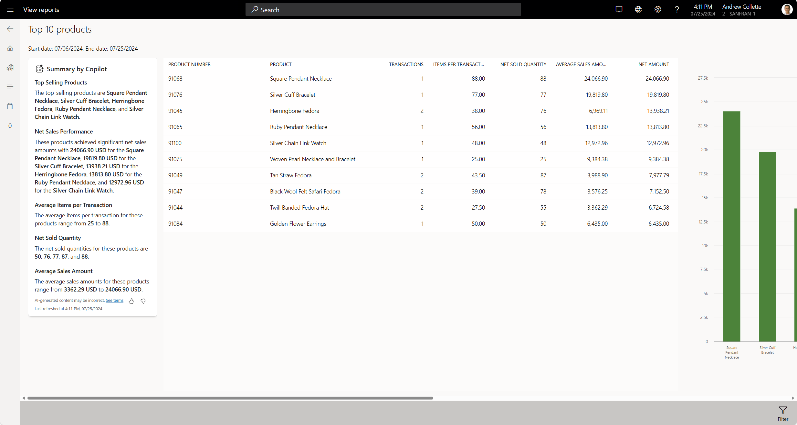

# Store report insights using Copilot

[!include [banner](includes/banner.md)]

This article describes how Copilot-generated insights for store reports simplifies the process of measuring the performance of your retail channels in Microsoft Dynamics 365 Commerce.

Store report insights using Copilot is a feature that uses artificial intelligence (AI) to generate natural language summaries of store reports in the Store Commerce app. Copilot helps you quickly understand the key insights and trends from your channel sales and store performance data. Copilot summaries are available for both out-of-box reports and custom store reports that you create in the Store Commerce app.

Store report insights by Copilot enhances store associate efficiency by providing real-time analysis of your store data. You can access Copilot-generated summaries every time you load a report in the Store Commerce app, without having to spend time on manual data interpretation. Copilot summaries are governed by data access control settings so you can ensure that only authorized users can view the reports. For example, a store cashier can analyze or view reports related to their own point-of-sale (POS) activity, while a store manager has broader permissions to access reports for the entire store's POS activity. Copilot can generate narrative summaries for channel reports, providing you with a clear and concise overview of your key indicators, such as sales, revenue, profit, margin, and overall store performance. You can also get real-time analysis, as Copilot updates the summaries as new data comes in.

## Enable Copilot in the Store Commerce app

To use Store report insights by Copilot in Store Commerce app, you need to follow these three steps:

1. In Commerce headquarters, go to the **Feature management** workspace (**Systems administration \> Workspaces \> Feature management**) and enable the temporary **Enable Copilot in Store Commerce** feature flag. Enabling this feature gives governing control to your organization's administrators to control the rollout of Copilot features in the Store Commerce app. This flag will eventually be retired in the future.
1. Go to **Commerce shared parameters** (**Retail and Commerce \> Headquarters setup \> Parameters \> Commerce shared parameters**) and enable the **Enable Copilot in Store Commerce** flag to give additional governing control to your organization's administrators to manage the availability of Copilot features in the Store Commerce app. This flag is automatically enabled when you enable the temporary flag, and will continue to be available after temporary flag is retired. 
1. Go to your POS functionality profile (**Retail and Commerce \> Channel setup \> POS setup \> POS profiles \> Functionality profiles**). On the **Copilot** FastTab, enable **Report insights** to get Store insights by Copilot reports in the Store Commerce app.
1. Run the **1070 (Channel configuration)** job to sync these updated settings to the channel database.

TThis capability is available for customers using the following English language Commerce versions:

- Commerce version 10.0.39, PQU-4 onwards (CSU : 9.49.24184.3, Store Comm. App 9.49.24193.1)
- Commerce version 10.0.40, PQU-1 onwards (CSU : 9.50.24184.2, Store Comm. App 9.50.24189.1)

> [!NOTE]
> - AI-generated content may be incorrect. For more information, see [Service Agreement & Microsoft Products and Services Data Protection Addendum](https://aka.ms/BusinessApplicationLegal).
> - For Copilot experiences in the Store Commerce app, your Dataverse instance must be linked to your environment by enabling Copilot capabilities in your finance and operations apps. For more information, see [Enable Copilot capabilities in finance and operations apps](/dynamics365/fin-ops-core/dev-itpro/copilot/enable-copilot).
> - If your hosting environment is in one of the regions where Azure Open AI isn't currently available, consider enabling the **Move data across regions** capability in the Power Platform Admin Center (PPAC). If your Dynamics 365 Commerce environments are hosted in the EU Data Boundary, you use an Azure OpenAI endpoint in the same boundary. If the required AI services are already available in your Dataverse region, you don't have to set up support for cross-region calls. If cross-region data movement is required but is disabled, users aren't able to view Copilot-generated summaries in the Store Commerce app. [Learn more](/power-platform/admin/geographical-availability-copilot).

[!INCLUDE[footer-include](../includes/footer-banner.md)]
