# SPED-Reinf events

[!include [banner](../../includes/banner.md)]

All the information that the SPED-Reinf provides about taxes and contributions in a given assessment period is known as a *movement*. Therefore, every movement can contain one or more events.

To close the transmission of periodic events for a given movement in a specific assessment period, you must send event R-2099, *Closure of periodic event*. After the closure event is processed and validated, it's accepted. Acceptance of the closure event finalizes the sum of the calculation bases that are included in the movement. The tax credit can then be calculated, and the DARF can be generated to collect taxes and contributions that are owed.

If a correction or new events must be sent for a movement that is already closed, you must reopen the movement by sending event R-2098, *Reopening of periodic event*. After a movement is reopened, send a new closing event.

**When there is no movement in the assessment period**

The "no movement" situation for a taxpayer occurs only when there is no information to send to the periodic event group from event R-2010 to event R-2070. In this case, event R-2099, *Closure of periodic event*, which provides the information for closure, declares the non-occurrence of transactions in the first assessment period of the year that this situation occurs in. If the "no movement" situation persists in the following years, the taxpayer must repeat this procedure in January of each year.

**Receiving protocol**

The receiving protocol confirms that the information that was sent was successfully delivered and validated to the SPED-Reinf environment. The receiving protocol is the starting point for correcting or deleting a given event, if correction and deletion are allowed.

Every event that is transmitted has a receiving protocol. To correct an event, enter the number of the event's receiving protocol.

The amount of time that receiving protocols are kept in the government database isn't defined. Therefore, as a precaution, it's important that the taxpayer retain the protocols, because they provide proof that the ancillary tax obligation has been delivered and met.

> [!NOTE]
> The delivery protocol is transient information that provides proof that the event has been transmitted, and that the appropriate validation will be processed. The protocol doesn't demonstrate compliance with the ancillary obligation.

**Amendment and correction**

The procedure to amend information that is sent to the SPED-Reinf occurs only in events R-1000, *Taxpayer information*, and R-1070, *Administrative and lawsuits table*.

In all other cases where the information that was sent must be amended, the procedure for correction or deletion must be used.

**Deletion events**

To exclude events that were approved by the tax authority but incorrectly delivered, you must send event R-9000, *Deletion event*. In this event, you must identify the event to delete by filling in the **Event Type** tag (**TpEvento**). You must also fill in **Event Receipt Number** (**NRRECEVT**), which specifies the receipt protocol number of the file that was sent and must be deleted.

**Digital signature**

The digital certificate that is used in the SPED-Reinf must be issued by a certification authority that is accredited by ICP-Brasil. Certificates can belong to two series: **A** and **S**. 

- **A** – This series includes the digital signature certificates that are used for web identity confirmation on emails, virtual private networks (VPNs), and electronic documents, with verification of the integrity of its information.
- **S** – This series includes the confidentiality certificates that are used in the encoding of documents, databases, messages, and other sensitive electronic information.

The digital certificate must be of the **A1** or **A3** type. **A1** digital certificates are stored on the computer that they are used from. **A3** digital certificates are stored in a tamper-resistant portable device that contains a chip that can perform digital signing. These devices include smart cards and tokens. Because every operation is done by the chip on the device, and there is no external access to the private key of the digital certificate, these devices are reasonably secure.

Digital certificates are required at two moments:

- **For delivery actions:** Before the request for delivery to the SPED-Reinf starts, the requestor's digital certificate is used to help guarantee the safety of the information traffic on the internet. For the digital certificate to be accepted as a transmitter function, it must be of the e-CNPJ type.
- **For document signing:** Events can be generated by any fiscal establishment of the legal entity or its proxy. However, the digital subscriber of those events must belong to the main fiscal establishment (headquarters), its legal representative, or an attorney that is granted by means of electronic and non-electronic proxy.

Digital certificates that are used to sign the events that are sent to the SPED-Reinf must be enabled for the digital signature function in accordance with the certificate policy.

The events in the SPED-Reinf must be transmitted by using a valid digital certificate. However, an exception is made for micro and small businesses (ME and EPP) that meet the Simple Nacional criteria and have seven or fewer employees. These businesses can transmit their events using an access code.

## General process 

The process to generate each event includes the following steps.

1. Use an electronic message to create, validate, and deliver the event or batch of events through electronic message items.
2. The tax authority web service receives the batch and validates its contents.
3. The web service returns the result of processing. If the events or batches of events are successfully received, a receiving protocol is returned. Otherwise, an error message is shown. In that case, the taxpayer can fix the errors and resubmit the event through a new batch.

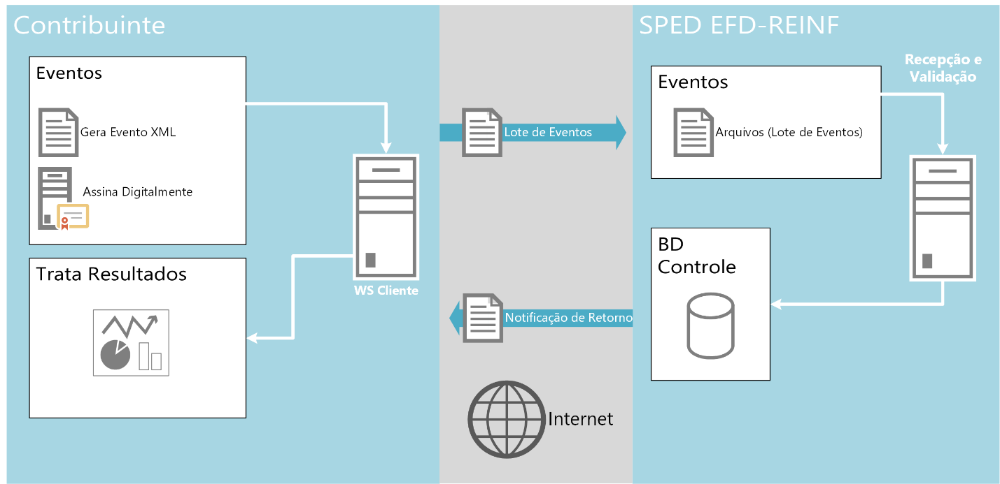

The events are transmitted to tax authorities using Electronic message functionality. This functionality establishes a two-way, automated, and instantaneous relationship between the government web services and the taxpayer.

The following illustrations show the actions that are performed, and the status of message items that causes each event to be approved or rejected when it's delivered for the first time (Insertion), updated (Amendment/Update), and canceled or deleted (Cancel/Delete).

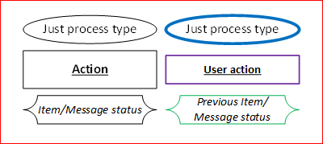

### Actions

**Insertion**

The main difference is the Consultar Protocolo step, which conforms with 2.1.2 REST API use.

> [!NOTE]
> **Send** has become **Send Reinf 2.1 Events**.
>
> Because of API changes, two extras have been added: **Query Protocol** and **Import Response**.

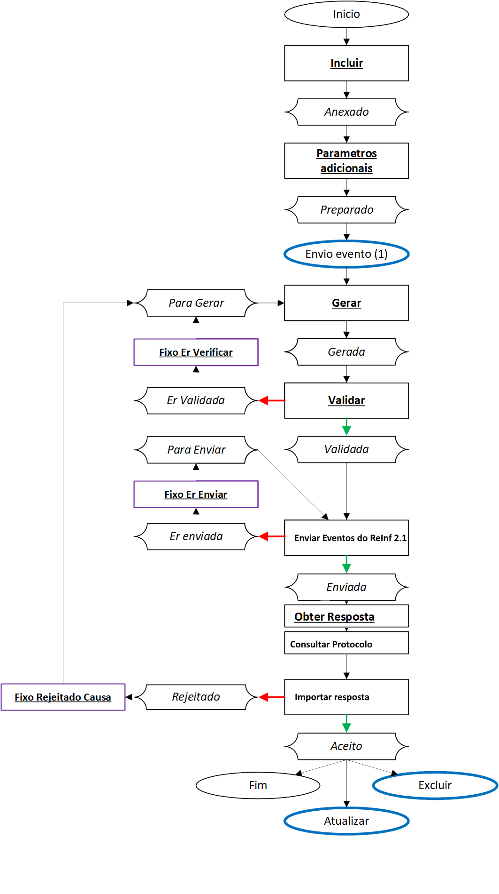

**Amendment/Update**

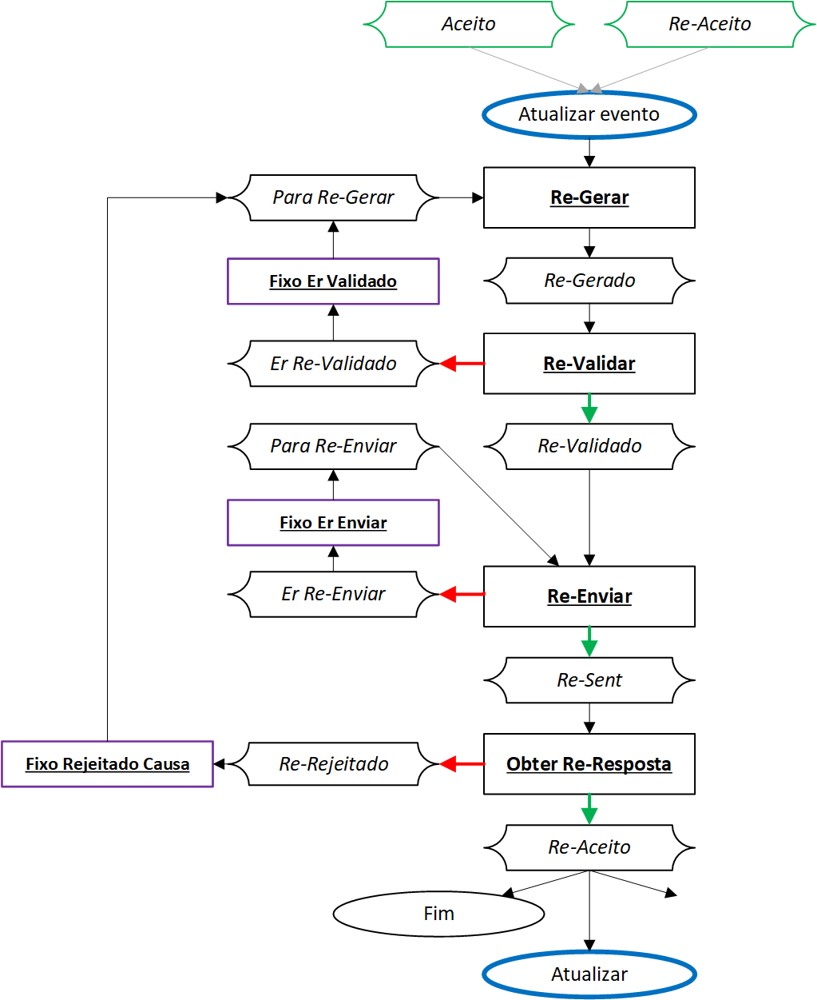

**Cancel/Delete**

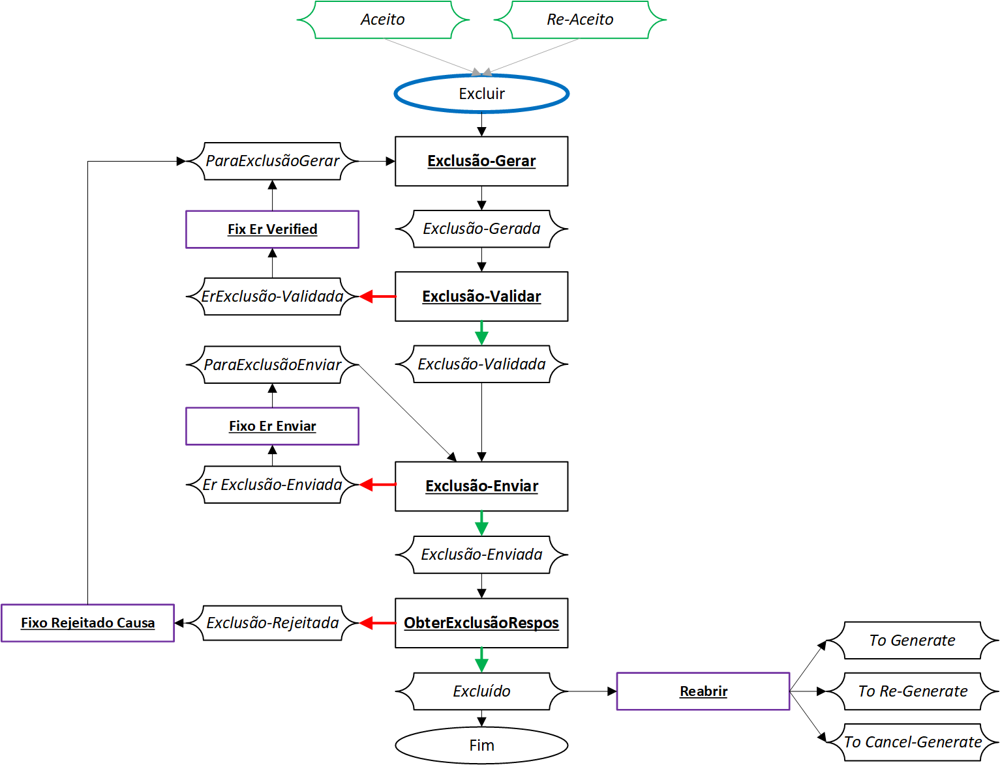

## Booking period

Before you start to generate these events, book all fiscal documents in the related event. 

1. Go to **Fiscal books** \> **Common** \> **Booking period**, and select the related booking period ID and fiscal establishment (head).
2. Select **Sync** to synchronize all fiscal documents. 
3. In the **SPED REINF** section, select the related event:

    - Select **R-2010**, and then select **Update** to collect all incoming fiscal documents where the model is **SE** and the tax type is **INSS**.
    - Select **R-2020**, and then select **Update** to collect all outgoing fiscal documents where the model is **SE** and the tax type is **INSS**.
    - Select **R-2055**, and then select **Update** to collect all incoming and outgoing fiscal documents that have SENAR or GILRAT taxes.
    - Select **R-4010**, and then select **Update** to collect all incoming fiscal documents (invoices and journal entries) from Person Vendors.
    - Select **R-4020**, and then select **Update** to collect all incoming fiscal documents from Organization Vendors.
    - Select **R-4040**, and then select **Update** to collect all incoming journal entries from an Unidentified Beneficiary.
    - Select **R-4080**, and then select **Update** to collect all outgoing fiscal documents that are eligible for auto-withholding.

4. Select **Inquire** to view the fiscal documents that are included in the related event.

    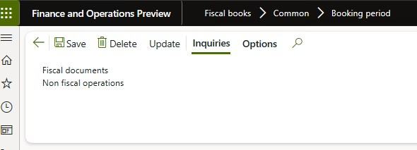

5. Go to **Tax** \> **Inquiries and reports** \> **Electronic messages** \> **Electronic message items**, because the status of events is managed and controlled by this action.

> [!NOTE]
> You can use the filter to include additional criteria during the collection of transactions.
> 
> The other events that weren't detailed earlier are automatically generated in electronic message items under specific conditions.

## Event R-1000 – Taxpayer information

Event R-1000 is used to deliver information about the company. This event must be delivered only one time to register the information on the government site. However, after the initial registration of information, the event can be delivered as many times as required for maintenance actions such as data updates and deletions.

Whenever any taxpayer attribute or the valid date of information that was provided earlier must be changed, event R-1000 must be delivered again. When the event is redelivered, the correct group of tags for the desired action must be specified.

Because communications can fail for technical reasons, such as a time-out or an internet shortage, the tax accountant must be able to resubmit the event. Additionally, because validation of the file by the web service can fail, the tax accountant must be able to view the details and fix the related errors. After the file is validated, the receiving protocol that is returned by the web service must be saved. The tax accountant must be able to view the details of the receiving protocol, such as the number and time stamp.

### Repro step – Insertion

1. Go to **Tax** \> **Inquiries and reports** \> **Electronic messages** \> **Electronic message items**.
2. On the Action Pane, select **Run processing**, and then, in the **Run processing** dialog box, in the **Processing** field, select **SPED Reinf**.
3. Set the **Choose action** option to **Yes**, and then, in the **Action** field, select **Incluir**.

    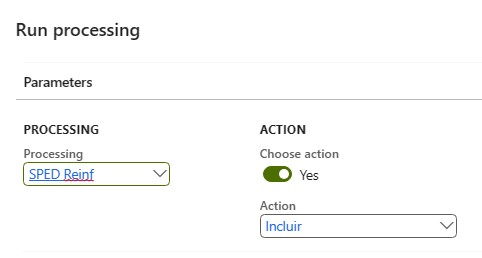

4. Select **OK** to confirm the settings.

    A message item of **Informações do contribuinte** type is created, and the status of the message item is set to **Anexado**.

    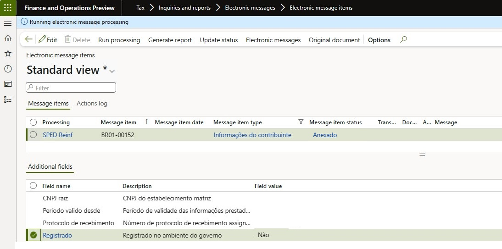

5. Select **Run processing** again, and then, in the dialog box, in the **Processing** field, select **SPED Reinf**.
6. Set the **Choose action** option to **Yes**, and then, in the **Action** field, select **Parâmetros adicionais** to update the related information in additional fields.

    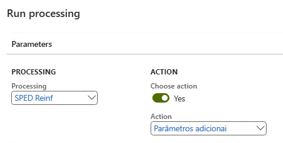

    

7. Select **OK** to confirm the settings. The message item of the **Informações do contribuinte** type is updated, and the status of the message item is changed to **Preparado**.

    

8. Select **Run processing** again, and then, in the dialog box, in the **Processing** field, select **SPED Reinf**.
9. Set the **Choose action** option to **Yes**, and then, in the **Action** field, select **Gerar** to generate the XML.
10. Select **OK** to confirm the settings. The **Generate reports** dialog box automatically appears. On the **Records to include** FastTab, in the filter options, the ID of the message item type that is requesting generation of an XML file is selected in the **Message item** field.

    

    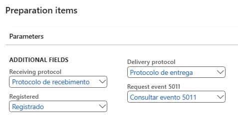

11. Select **OK** to confirm the settings. The message item of the **Informações do contribuinte** type is updated, and the status of the message item is changed to **Gerado**.
12. Repeat these steps until you've completed all the actions in the Insertion flow.

    

### Repro step – Amendment 

If any of the fiscal organization data has been changed, or if the event must be excluded for some reason, event R-1010 must be transmitted again, but the status must be different.

Use the process that is described in the [Repro step – Insertion](#repro-insert) section, and complete all the actions in the Amendment/Update flow.

Any differences between the information in the last event and the current information will be detected.

> [!NOTE]
> If changes don't affect the related R-1010 event, you will receive the following message: "0 records have been added."

#### Repro step – Cancel

If, for any reason, the taxpayer wants to cancel or exclude an event that has been accepted, select **Cancel**, and confirm the operation. The status of the event will be updated to **Excluded**. Complete all the actions in the Cancel/Delete flow.

## Event R-1050 – Table of linked entities

Event R-1050 is used to report information about linked entities. This record provides information about entities that are connected to the taxpayer, such as FCI (Investment Fund) or SCP (Limited Partnership). It also covers additional descriptive information about the legal entities that are using REINF to submit their declarations.

1. Go to **Organization administration** \> **Organizations** \> **Fiscal establishments** \> **Fiscal establishments**.
2. On the **Fiscal establishment relations** tab, add any related information that is required.

### Repro step

1. Go to **Organization administration** > **Organizations** > **Fiscal establishments** > **Fiscal establishments**.
2. On the **Fiscal establishment relations** tab, add any needed related information.
3. Select **New** to add the new field **SP01**, and add the apropriate fiscal establishment relations.

   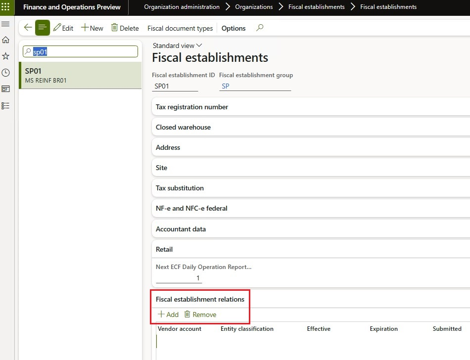

## Event R-1070 – Administrative and judicial process

Event R-1070 is used to report information about the administrative and lawsuits process to the tax authority.

The administrative and lawsuits process can be started by the taxpayer or the worker when the amounts in social security are disputed. The proceedings (either judicial or administrative) are carried out by the court. After the judge reaches a final decision, they have the power to suspend the amounts that were retained.

The purpose of this event is to communicate the existence of proceedings of this type to the SPED-Reinf database. After the proceedings have a final court decision that suspends the eligibility of withholding amounts, the event refers to that decision to explain why the amounts have been reported as suspended in the periodic events.

Besides the typical information that identifies the taxpayer and the event, event R-1070 contains the following groups:

- Identifier of the process or proceedings
- Suspension information
- Complementary information about the proceedings

Before the event R-1070 can be delivered, create the related process, and include all related information.

### Repro step – Create process

1. Go to **Fiscal books** \> **Periodic** \> **SPED Reinf** \> **Administrative and judicial process**.

    

2. Select **New**, and set the following fields.

    | Field                        | Description |
    |------------------------------|-------------|
    | Number of the process        | Enter the process number that was assigned by the competent authorities. The tax authority system validates the format, because there is a specific rule to consider. |
    | Author of process            | Select the source that the process originated from. |
    | Type of process              | Select the type of process:<ul><li>Taxpayer</li><li>Other third party</li><li>Administrative</li><li>Judicial</li></ul> |
    | City of the judicial section | Select the related city where the process originated. |
    | Code of the judicial section | Enter the code for the judicial section. |

3. In the **Details** section, enter details of the fiscal documents that are registered in Finance and affected by the registered process, because some of them might have exceptions in withholding taxes. You can add fiscal documents, or you can remove fiscal documents that were previously added.

    | Field                            | Description                                                                                               |
    |----------------------------------|-----------------------------------------------------------------------------------------------------------|
    | Reference                        | The unique identifier of the relation between the process number and the fiscal document.                 |
    | Code                             | Select the explanation suspension code.                                                                   |
    | Service type                     | Select the related service type that is applicable for the fiscal document.                               |
    | Fiscal document                  | Select the fiscal document.                                                                               |
    | Date of decision                 | The date of the decision, sentence, or administrative dispatch.                                           |
    | Amount of withholding            | The amount of withholding that was suspended because of an administrative or lawsuits process.            |
    | Amount of additional withholding | The additional amount of withholding that was suspended because of an administrative or lawsuits process. |

    > [!NOTE]
    > Follow the steps that are described for event R-1000 to insert, update, or cancel the related event.

## Event R-2010 – Acquired services

Periodic event R-2010 is used to report, to the tax authority system, information about the withholding amounts for social security that are present in service fiscal documents that were received by the fiscal establishment. The only purpose of this event is to report those fiscal documents to the government.

This event must be sent until the fifteenth day of the next month. Because it's a periodic event, we don't recommend that you send the event just one time, near the due date. Instead, send the event regularly and frequently during the period.

Additionally, generation of this event requires the adoption of new semantics for handling events in fiscal books. The new semantics are decoupled from a tax assessment but are still in the context of the booking period. After every fiscal document in the **Fiscal books** module is in the context of a booking period, event R-2010 must also be generated by booking period.

Only service and retained INSS tax type must be selected to generate this event in the booking period.

**Main criteria**

- The fiscal documents are booked and synced in the related period and fiscal establishment.
- The fiscal documents have a status of **Approved** or **Canceled**.
- The fiscal document model is **SE**.
- The tax type is **INSS**, and it's retained (that is, the **Retained tax/to recuperate** option is set to **Yes**).

    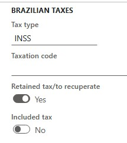

> [!NOTE]
> Never use the **INSS-CPRB** tax type.

The report is grouped by the **Type of service code** value (table 06 from the SPED-Reinf documentation). Therefore, you must modify the posting of service fiscal documents to enable this information to be captured. Otherwise, the event can't be generated.

The event sends four types of amounts to the government database:

- **Withholding** – The calculated retained INSS tax type that is linked to the fiscal document line.
- **Additional withholding** – A variation of the INSS tax type that is linked to the fiscal document line.
- **Suspended withholding** – The amount of the suspended retained INSS tax type.
- **Suspended additional withholding** – The suspended amount on the variation of the INSS tax type that is linked to the fiscal document line.

When a suspension of amounts occurs, the associated administrative or lawsuits process must be specified in the event to support or explain the reasons for the suspension. Manually enter this information in the **Amount of withholding** and **Additional amount of withholding** fields on the **Administration and judicial process** page that is described earlier in the article.

Event R-2010 uses the concept of closing. After this event is closed, the web service will refuse any new entries or modifications for it, unless it's manually reopened.

> [!NOTE]
> Follow the steps that are described for event R-1000 to insert, update, or cancel the related event.

## Event R-2020 – Provided services

Periodic event R-2020 is used to report, to the tax authority system, information about the withholdings amounts for social security that are present in service fiscal documents that were issued by the fiscal establishments of a fiscal organization.

This event works like event R-2010, but you must consider customer accounts and fiscal document model SE (outgoing) that is issued by the fiscal establishment.

> [!NOTE]
> Follow the steps that are described for event R-1000 to insert, update, or cancel the related event.

## Event R-2055 – Acquisition from agriculture vendor

Periodic event R-2055 is used to report, to the tax authority system, information about the withholding amounts for social security, SENAR, and GILRAT that are present in fiscal documents that were received by the fiscal establishment in relation of agriculture products. The only purpose of this event is to report those fiscal documents to the government.

This event must be sent until the fifteenth day of the next month. Because it's a periodic event, we don't recommend that you send the event just one time, near the due date. Instead, send the event regularly and frequently during the period.

Generation of this event requires the adoption of new semantics for handling events in fiscal books. The new semantics are decoupled from a tax assessment but are still in the context of the booking period. After every fiscal document in the **Fiscal books** module is in the context of a booking period, event R-2055 must also be generated by booking period at **Fiscal books** \> **Booking period** \> **SPED Reinf** \> **R-2055**.

**Main criteria**

- The fiscal documents are booked and synced in the related period and fiscal establishment.
- The fiscal documents have a status of **Approved** or **Canceled**.
- The fiscal document model is **04** or **55**. 
- The tax type is **INSS**, and it's retained (that is, the **Retained tax/to recuperate** option is set to **Yes**).
- The tax type is **Other**, it's retained (that is, the **Retained tax/to recuperate** option is set to **Yes**), and GILRAT or SENAR taxes are identified.

    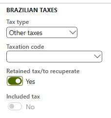

## Event R-2060 – INSS CPRB

Periodic event R-2060 is used to send information about the tax assessment of the withholding for social security to the SPED-Reinf when the fiscal organization has chosen to calculate the social security based on the gross revenue instead of the payroll.

Before you generate the event, do the tax assessment by fiscal organization in the **Fiscal books** module. When this option is established in the SPED-Reinf parameters, you can create the tax assessment for INSS-CPRB, and taxes are automatically calculated based on the criteria that are defined in the Fiscal books parameters.

Finance will pick up all fiscal documents that are booked in the related period and represent revenue, and will apply the tax rate to the base amount. The tax rate that is applied can vary, depending on the product or service that generated the revenue. The result will be the amount of CPRB.

For this purpose, a new Brazilian tax type, **INSS-CPRB**, is created. This tax type is used only to generate the INSS-CPRB tax assessment.

> [!NOTE]
> Don't use the **INSS-CPRB** tax type for other purposes.

Because the INSS-CPRB tax assessment is a type of tax assessment, adjustments might become necessary. These adjustments must be manually entered as additions or reductions.

Finally, the tax assessment and the adjustments determine the amount of CPRB that must be paid. However, generation of the payment journal and registration on this payment isn't in the scope of this feature.

Periods for this tax assessment must be managed in the same way as other tax assessments. In other words, the tax assessment can be created or updated only while it's open. After it's finalized, it can no longer be touched unless it's reopened.

After the tax assessment is created, and any required adjustments are made, you can generate periodic event R-2060.

Event R-2060 includes the tax assessment totals and the details of the tax calculations by economic activity code, adjustments, and references to administrative and lawsuits processes.

### Repro step – Setup

1. Go to **Fiscal books** \> **Setup** \> **Fiscal organization**.
2. Set the **CPRB** option to **Yes** to enable creation of the INSS-CPRB assessment and transmission of event R-2060.
3. Go to **Fiscal books** \> **Setup** \> **Sped Reinf** \> **Economic activity codes**. Economic activity codes must be configured to enable automatic calculation of INSS-CPRB tax amounts, because the fiscal document has no related information about this tax. This approach was implemented to facilitate the configuration of the tax matrix.
4. Select **New** to create an economic activity code, and enter a description. Check the Sped REINF Table 09 on the tax authority website.
5. Select the tax code that contains the tax rate to apply for the product or service. You must create a **Retained INSS** tax type.
6. On the **Line** tab, enter the products or services that are related by the economic activity. Products are identified by the fiscal classification code, and services are identified by the service code (federal).

### Repro step – Create a tax assessment (option 1)

1. Go to **Fiscal books** \> **Common** \> **Booking period**.
2. Select a booking period.
3. On the Action Pane, select **INSS-CPRN**, and then select **New** to create a tax assessment. A tax assessment for the selected booking period is automatically created.

### Repro step – Create a tax assessment (option 2)

1. Go to **Fiscal books** \> **Common** \> **Tax assessment** \> **INSS-CPRB**, and then select **INSS-CPRB tax assessment**.
2. Select the booking period, and then select **OK**.

> [!NOTE]
> You might receive the following warning: "Line XXXX: unable to identify the economic activity code." This warning indicates that the economic activity code for the related fiscal document and line wasn't found. In this case, complete the setup that is described in the previous repro step.

**Delete**

You can delete an existing INSS-CPRB tax assessment if the status is **Opened**.

**Fiscal documents and non-fiscal operations**

When INSS-CPRB taxes are assessed, the taxable amount of the fiscal document is considered and classified during the assessment process. You can view the related fiscal documents and non-fiscal operations (journals) that are part of the tax calculation.

**Tax transactions**

When INSS-CPRB taxes are assessed, you can view the tax transactions details that are generated by the process.

**Adjustment**

You can enter into additional adjustment transactions to adjust (increase or decrease) the amount of INSS-CPRB that is calculated. You configure the adjustment codes at **Fiscal books** \> **Setup** \> **Tax adjustment codes** \> **INSS-CPRB adjustments codes table**.

1. Select **Adjustment** to add an adjustment transaction that will decrease or increase the tax amount (debit) that is calculated.
2. Select the adjustment code.
3. Enter a description of the related transaction.
4. Specify the adjustment amount and the economic activity.
5. Specify the adjustment date.

> [!NOTE]
> Adjustments for INSS-CPRB are available only through this procedure. This type of adjustment isn't available at **Fiscal books** \> **Journals** \> **General tax adjustment/benefit/incentive**.

**Finalize and Reopen**

You can finalize or reopen the related INSS-CPRB tax assessment.

When an INSS-CPRB tax assessment is finalized, no modifications to the tax assessment are allowed for that period, unless the tax assessment is reopened. A voucher is created to post the INSS-CPRB tax to collect, and the ledger accounts are defined in the ledger posting for INSS tax at **Tax** \> **Setup** \> **Sales tax** \> **Ledger posting groups**.

> [!NOTE]
> In the current SPED-Reinf architecture that is defined by the government, the process for payment and settlement of the liability that is created by the tax assessment will be reported to another system that is named DCTF web. This system consumes the output from the SPED-Reinf and other systems, such as eSocial and PER/DCOMP. Therefore, the payment process is currently out of scope and is delivered through another Dynamics 365 feature.

The **Reopen** action is available if event R-2060 has already been closed for the root fiscal establishment, and if the tax assessment is already finalized. The **Reopen** action reverses the previous voucher that was generated by the closing action.

> [!NOTE]
> Follow the steps that are described for event R-1000 to insert, update, or cancel the related event.

## Events R-2090 – Closing and R-2098 – Reopen

**Closing**

Periodic events R-2010, R-2010, and R-2060 must be closed at the end of a period, when there are no more transactions to report in that period.

### Repro step

1. Finalize the INSS-CPRB tax assessment, even if you don't assess INSS-CPRB tax.
2. Follow the steps that are described for event R-1000 to insert, update, or cancel the related event.

**Reopen**

After periodic events R-2010, R-2010, and R-2060 are closed through an event R-2099, they can be reopened through an event R-2098. You can then report new transactions or modify existing transactions for the period.

### Repro step

1. Reopen the INSS-CPRB tax assessment, even if you don't assess INSS-CPRB tax.
2. Follow the steps that are described for event R-1000 to insert, update, or cancel the related event.

## R-4010 Payments/credits to individual beneficiaries

**R-4010 - Payments/Credits to Individual Beneficiaries:** In this record, taxpayers will report payments and credits that are made for non-employment service contracts with individuals for the purpose of withholding income tax (IR). There will be one event for each beneficiary record. Information that is related to IR on labor will be submitted through eSocial.

### Repro step

Create a transaction by using the general journal.

The R-4010 event should be entered only with the parameters of **Vendor** and **Ledger**.

1. Go to **General Ledger** \> **Journal entries** \> **General journals**, and select **New**.
2. Select **Lines**, and then, in the **Account type** field, select **Vendor**.
3. Select an account, and enter a description of the journal.
4. Enter a credit, and then, in the **Offset account type** field, select **Ledger**.
5. In the **Offset account** field, select **FiscalEstablishment**.
6. In the **Item sales tax group** field, select a value.
7. In the **Sales tax group** field, select a value.
8. In the **Income code** field, select a code.

    

9. Post the transaction by using a purchase order. Go to **Accounts payable** \> **Purchase orders** \> **All purchase orders**, and select **New**.
10. Select a vendor account, and then, in the **Type** field, select **Person**.
11. Select a site and a warehouse.

**Add a purchase order line**

1. Select a purchase line, and then, in the **Item number** field, select an item number. You create order lines for products and services by specifying an item number.
2. Add the item and the sales tax group.
3. On the **Fiscal information** tab, if the **Item** field is set to **Service**, verify that a service code has been added.
4. On the **Purchase** tab, select **Actions** \> **Confirm**.
5. On the **Invoice** tab, select **Generate** \> **Invoice**.
6. On the **Vendor invoice** tab, review the information in the **Document model**, **Number**, **Series**, and invoice dates fields.
7. Select **Post**.

After you complete these steps, the purchase order–related fiscal document is available to be synchronized into the booking period for submission.

## R-4020 Payments/credits to legal entity beneficiaries

**R-4020 - Payments/Credits to Legal Entity Beneficiaries:** In this EFD REINF record, there is one event for each beneficiary record, declaring payments/credits that are related to payments for services that legal entities provide.

### Repro step

- For a general journal transaction, follow the steps in the **R-4010** process. The participant should be a legal entity.
- For a purchase order transaction, follow the steps in the **R-4010** process. The participant should be a legal entity. After you complete these steps, the purchase order–related fiscal document is available to be synchronized into the booking period for submission.

## R-4040 Payments/credits to unidentified beneficiaries

**R-4040 - Payments/Credits to Unidentified Beneficiaries:** The R-4040 event reports payments where the beneficiary can't be identified, such as situations where no fiscal document is issued.

### Repro step

- For a general journal transaction, follow the steps in the **R-4010** process. The participant should be a legal entity. After you complete the steps, the purchase order–related fiscal document is available to be synchronized into the booking period for submission.

## R-4080 Auto Withholding

**R-4080 - Withholding on Receipt:** Also known as self-withholding, this operation primarily occurs in conditioning processes, such as in advertising agencies, card operators, and travel agencies. These activities are specified in the legislation and perform their own withholding. The transmission is done by the recipients of the income, not by the payers.

### Repro step

Create a sales order transaction

The following steps provide an example that shows how to create a sales order entry.

1. Go to **Accounts receivable** \> **Orders** \> **All sales orders**, and select **New**.
2. Select a customer account, and then, in the **Type** field, select **Organization**.
3. Select a site and a warehouse.
4. Select **Sales line**.
5. In the **Item number** field, select an item number. You create order lines for products and services by specifying an item number.
6. Add the items and sales tax group.
7. On the **Fiscal information** tab, if the **Item** field is set to **Service**, verify that a service code has been added.
8. On the **Invoice** tab, select **Generate** \> **Invoice**.
9. On the **Posting invoice** tab, review the information in the **Fiscal Document type**, **Number**, **Series**, and invoice dates fields.
10. Select **OK**.

After you complete these steps, the sales order–related fiscal document is available to be synchronized into the booking period for submission.

## R-4099 Closure/reopening of R-4000 series events

**R-4099 - Closure/Reopening of Periodic Events in the R-4000 series:** This event is transmitted after all periodic event records have been closed. It can also be used to reopen a period of a specific record.

### Repro step

To generate the closure event, follow these steps.

1. Go to **Fiscal books** \> **Common** \> **Booking period**, and select the period.
2. Select **R-4098** (**Reopen**) and **R-4099** (**Closure**).

## Event sending flow

Send events R-1000, R-1050, R-1070R-2010, R-2020, R-2055, R-2060, R-2099, and R-4000.

1. Go to **Tax** \> **Inquiries and reports** \> **Electronic messages** \> **Electronic message items**.
2. Select **Processing** \> **Processing SPED REINF**, and then select one of the following options:

    - Incluir
    - Parametros adicionais
    - Gerar
    - Validar
    - Enviar Eventos do REINF 2.1
    - Obter resposta
    - Importar resposta

[!INCLUDE[footer-include](../../../includes/footer-banner.md)]
