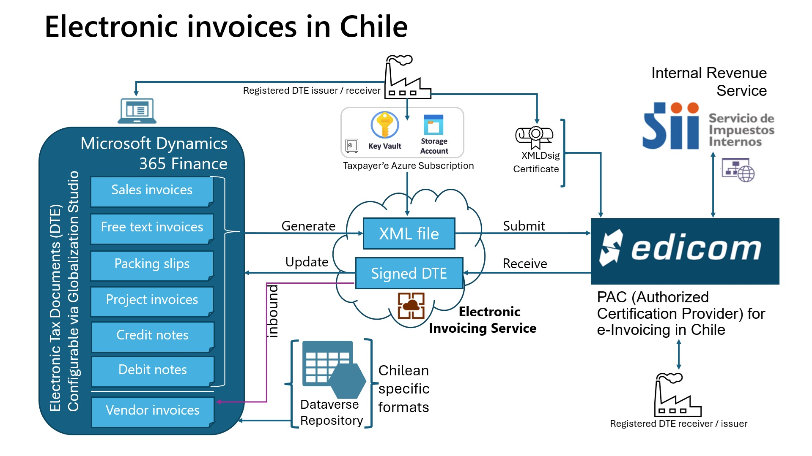

# Connection configuration for Chilean electronic invoicing

[!include [banner](../../includes/banner.md)]

This article provides information that will help you get started with Electronic invoicing for Chile. It guides you through the configuration steps that are country/region-dependent in Dynamics 365 Finance or Dynamics 365 Supply Chain Management. These steps complement the steps that are described in [Electronic invoicing setup](../global/e-invoicing-set-up-overview.md).

After you configure electronic invoicing, you can generate, digitally sign, and submit the XML files of electronic invoices to the Authorized Certification Providee **Edicom** according to the [regulatory requirements in Chile](https://www.sii.cl/servicios_online/1039-1182.html).

> [!NOTE]
> The electronic invoicing approach that this article describes is implemented by using an invoicing service that's applicable only to cloud deployments of Finance or Supply Chain Management.

## Prerequisites

Before you begin the procedures in this article, the following prerequisites must be met:

- Gain familiarity with and understanding of Electronic invoicing as it's described in [Electronic invoicing overview](../global/e-invoicing-service-overview.md).
- Do the common part of electronic invoicing service configuration as described in [Set up electronic invoicing](../global/gs-e-invoicing-set-up-overview.md).
- Make sure that the following Electronic reporting (ER) format configurations are imported. For more information, see [Import Electronic reporting (ER) configurations](../../../fin-ops-core/dev-itpro/analytics/electronic-reporting-import-ger-configurations.md).

    - Inventory e-invoice (CL)
	- Inventory Export e-Invoice (CL)
    - E-shipping guide (CL)
    - Project e-invoice (CL)
	- Project Export e-Invoice (CL)
    - Edicom response processing (CL)
	- Edicom response error log import

    > [!NOTE]
    > These formats are based on the corresponding **LATAM** format configurations that use the **Invoice model** and **Invoice model mapping** configurations. All required additional configurations are automatically imported.

## Country/region-specific configuration for Electronic invoicing for Chile

Some parameters of the **E-Invoicing for Chile: ISV last-mile connector with Edicom** feature are published with default values. Before you deploy the electronic invoicing feature to the service environment, review the default values, and update them as required, so that they better reflect your business operations.

1. Import the latest version of the **Chilean electronic invoice (CL)** Globalization feature. For more information, see [Import features from the Global repository](../global/e-invoicing-import-feature-global-repository.md).
2. Create a copy of the imported Globalization feature, and select your configuration provider. For more information, see [Create a Globalization feature](../global/e-invoicing-create-new-globalization-feature.md).
3. Specify values on the **Feature parameters** tab. These are connection and integration parameters to interoperate with Edicom's API.
    > [!NOTE]
    > The **Electronic invoicing for Chile** feature is provided by Microsoft. The feature is ready to use and requires no additional configuration. For information about how to configure invoicing features if you must apply changes, see [Work with feature setups](../global/e-invoicing-feature-setup.md). For example, you can filter specific legal entities so that they're processed in applicability rules. By default, the feature is applicable to all legal entities that have a primary address in Chile.

3. The copy of the feature is always created as a **Draft** version. Regardless of whether you made changes, you must complete, publish, and deploy the feature as described in [Complete, publish, and deploy a Globalization feature](../global/e-invoicing-complete-publish-deploy-globalization-feature.md).

## Finance configuration

Some parameters must be configured directly in Finance.

1. Make sure that the country/region-specific ER configurations for the document context and electronic document model mapping that are required for Chile are imported. For more information, see [Set up Electronic document parameters](../global/e-invoicing-set-up-parameters.md#set-up-electronic-document-parameters).

    > [!NOTE]
    > After you import the **Electronic invoicing for Chile** feature, electronic documents are configured by default. Follow these remaining steps of this procedure if you must make changes.

2. Go to **Organization administration** \> **Setup** \> **Electronic document parameters**.
3. In the **Electronic document** section, add records for the **Customer Invoice journal**, **Customer packing slip journal**, and **Project invoice** table names.
4. For each table name, set the **Document context** and **Electronic document model mapping** fields in accordance with step 1.
5. Save your changes, and close the page.

## Issue electronic invoices

After you complete all the required configuration steps, you can generate electronic invoices for posted invoices. You can inquire about the results of the submission by going to **Organization administration** \> **Periodic** \> **Electronic documents** \> **Electronic document submission log** and selecting the required document type.

To download the XML files of electronic invoices for successfully processed invoices, select **Electronic document** \> **Download file**.

> [!IMPORTANT]
> In current implementations, the standard submission procedure described above only generates electronic invoices and stores their XML files on the service side, but it doesn't submit the invoices. For the submission of Chilean electronic invoices, integration with the [Electronic Invoicing service ISV last-mile connector](../global/e-invoicing-isv-connector.md) is required. However, this connector hasn't been released yet.

## More resources

- [Electronic invoicing overview](../global/e-invoicing-service-overview.md)
- [Get started with Electronic invoicing service administration](../e-invoicing-get-started-service-administration.md)
- [Get started with Electronic invoicing](../e-invoicing-get-started.md)
- [Electronic Invoicing service independent software vendor (ISV) last-mile connector](../global/e-invoicing-isv-connector.md)

[!INCLUDE[footer-include](../../../includes/footer-banner.md)]
